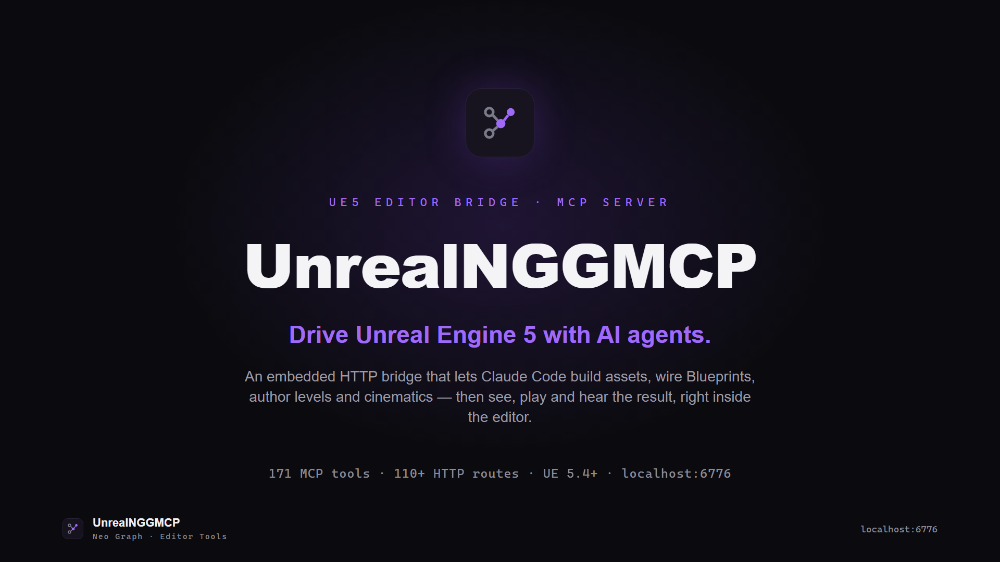
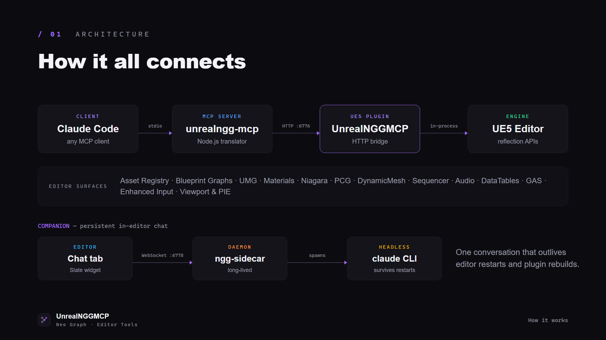
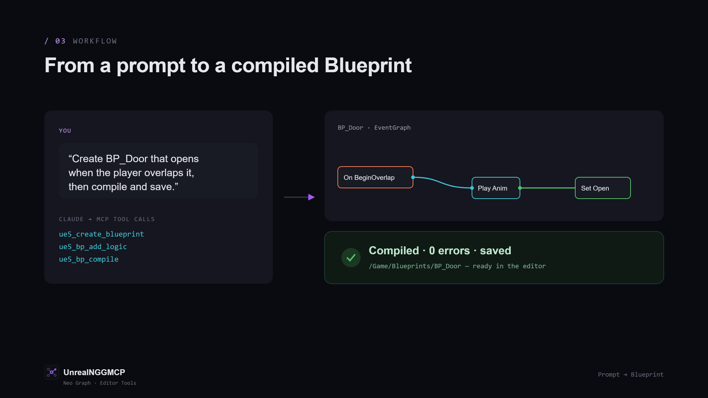
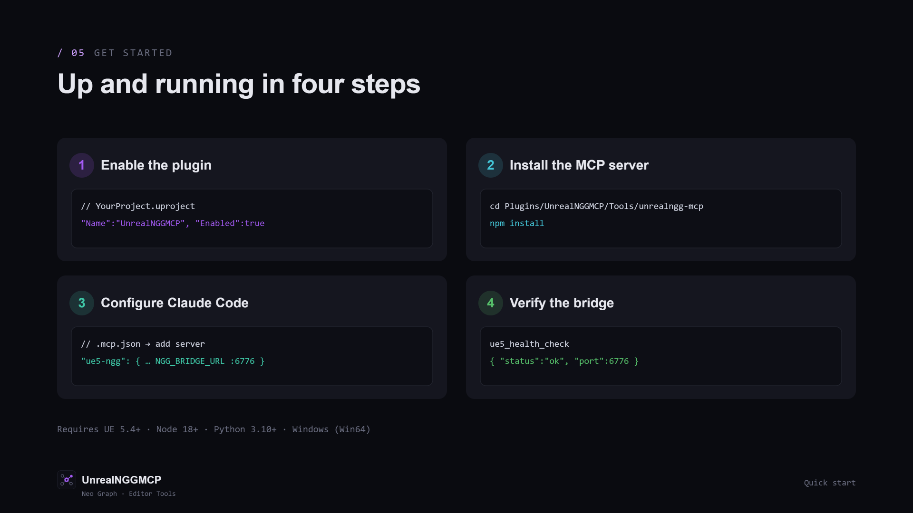
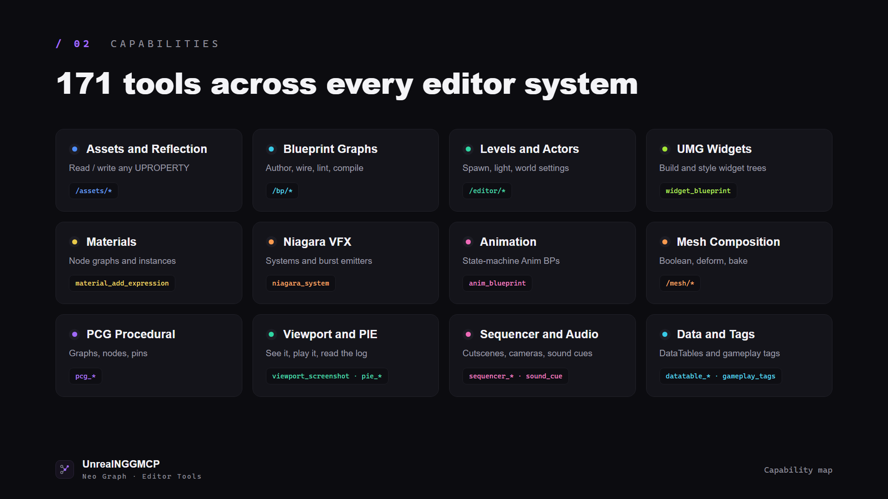
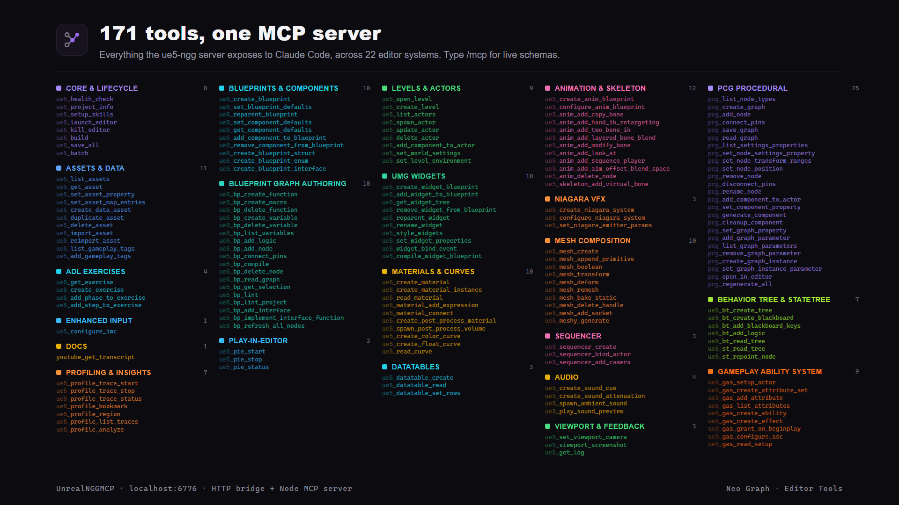
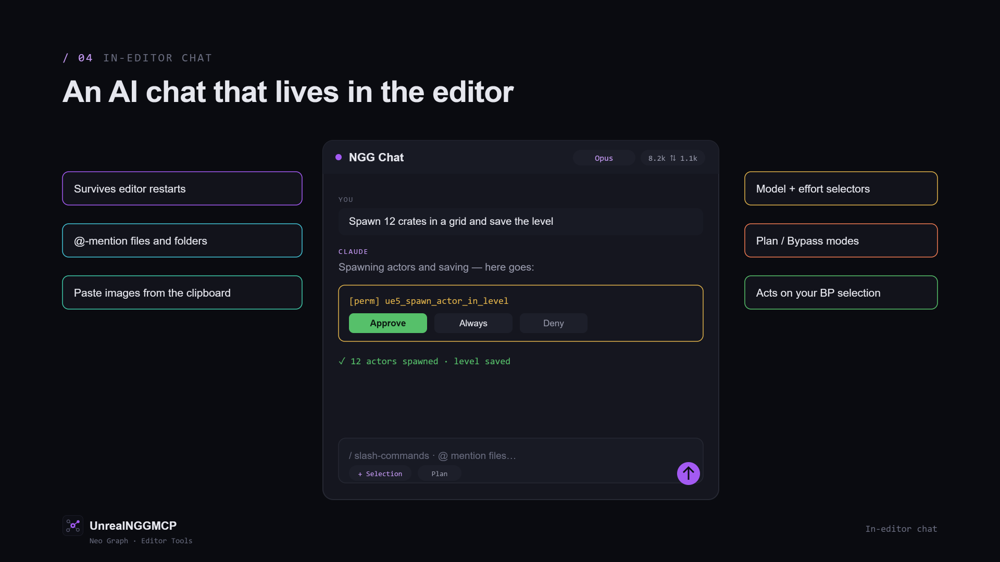

# UnrealNGGMCP — UE5 Editor Bridge for Claude Code



UnrealNGGMCP is a multi-part system that lets Claude Code (and any MCP-compatible AI client) drive Unreal Engine 5 Editor asset operations over a local HTTP bridge. It also embeds an in-editor **Chat window** that talks to a long-lived Claude Code daemon, so a single conversation survives editor restarts and plugin rebuilds.

```
Claude Code  ──stdio──►  unrealngg-mcp (Node.js MCP server)
                                │
                         HTTP :6776
                                │
                         UnrealNGGMCP (UE5 Editor plugin)     ◄─┐
                                │                               │
                      UE5 Editor APIs (Asset Registry,          │
                      Blueprint editor, UMG, PCG, …)            │
                                                                │
 In-editor Chat tab (SNGGChatWindow)  ──WebSocket :6778──►  ngg-sidecar
                                                                │
                                                                ▼
                                                          claude CLI
                                                          (headless)
```



*The same flow, visualized: Claude Code → the Node MCP server → the UE5 HTTP bridge → the editor's reflection APIs, with the persistent in-editor Chat tab running alongside.*

A natural-language prompt becomes a real, compiled asset — the model issues `ue5_*` tool calls, the bridge applies them in the editor, and the result lands back in the Content Browser:



**Components in this repo:**

| Folder | Role |
|---|---|
| `Plugins/UnrealNGGMCP/` | UE5 Editor plugin — HTTP bridge + Slate Chat widget |
| `Plugins/UnrealNGGMCP/Tools/unrealngg-mcp/` | Node MCP server Claude Code spawns; translates MCP tool calls into HTTP |
| `Plugins/UnrealNGGMCP/Tools/ngg-sidecar/` | Persistent Node daemon that hosts the Chat window's `claude` subprocess |
| `Plugins/UnrealNGGMCP/Tools/bp-extract/` | Python (≥3.10, stdlib) Blueprint→C++ port pipeline — read-only over the bridge; project-agnostic (see [bp-extract conversion pipeline](#bp-extract-conversion-pipeline)) |

Each has its own README with deeper detail. This doc is the integration-level overview.

---

## Contents

1. [Requirements](#requirements)
2. [Quick Start](#quick-start)
3. [Integrating into a new UE5 project](#integrating-into-a-new-ue5-project)
4. [Configuration](#configuration)
5. [Authentication](#authentication)
6. [HTTP API reference](#http-api-reference)
7. [MCP tools reference](#mcp-tools-reference)
8. [Adding custom routes (extension API)](#adding-custom-routes-extension-api)
9. [Environment variables](#environment-variables)
10. [Troubleshooting](#troubleshooting)

---

## Requirements

| Component | Minimum version |
|---|---|
| Unreal Engine | 5.4 LTS or later |
| Node.js | 18.0.0 or later (for the MCP server + Chat sidecar) |
| Python | 3.10 or later (UE's `PythonScriptPlugin` runtime — used by the PCG routes and `bp-extract`) |
| Claude Code | Any current release (only for AI-driven use; the HTTP bridge works without it) |
| OS | Windows (plugin built for Win64) |

> The UE5 Editor plugin (the HTTP bridge) is self-contained and needs none of the
> Node tools to run. Node.js + Claude Code are only required for the MCP-client and
> in-editor Chat features. These external dependencies must be installed by the user
> and are listed here per Fab's external-dependency disclosure requirement.

---

## Quick Start



Assumes the plugin is already enabled in a UE5 5.4+ project. For a fresh install see [Integrating into a new UE5 project](#integrating-into-a-new-ue5-project).

### 1. Open the project in UE5 Editor

Open `YourProject.uproject`. The `UnrealNGGMCP` plugin loads automatically at `PostEngineInit`. Confirm in the Output Log:

```
LogNGGBridge: UnrealNGGMCP: HTTP bridge listening on http://localhost:6776
```

If the optional ADL module is included, you'll also see:

```
LogNGGADL:    UnrealNGGMCP_ADL: ADL exercise routes registered (/adl/exercise/*)
```

### 2. Install MCP server dependencies

```bash
cd Plugins/UnrealNGGMCP/Tools/unrealngg-mcp
npm install
```

### 3. Verify Claude Code config

`.mcp.json` at the project root is already configured:

```json
{
  "mcpServers": {
    "ue5-ngg": {
      "command": "C:\\Program Files\\nodejs\\node.exe",
      "args": ["Plugins/UnrealNGGMCP/Tools/unrealngg-mcp/index.js"],
      "cwd": "<absolute path to project root>",
      "env": {
        "NGG_BRIDGE_URL": "http://localhost:6776",
        "NGG_BRIDGE_TIMEOUT_MS": "15000"
      }
    }
  }
}
```

### 4. Run the health check

In Claude Code, type:

```
ue5_health_check
```

Expected response (project name is auto-detected from the `.uproject`):

```json
{ "status": "ok", "project": "YourProject", "port": 6776 }
```

---

## Integrating into a new UE5 project

Follow these steps to add UnrealNGGMCP to any UE5 5.4+ project.

### Step 1 — Copy the plugin

Copy `Plugins/UnrealNGGMCP/` into your project's `Plugins/` folder:

```
YourProject/
  Plugins/
    UnrealNGGMCP/
      UnrealNGGMCP.uplugin
      Source/
        UnrealNGGMCP/          ← core bridge (generic, no project deps)
        UnrealNGGMCP_ADL/      ← optional ADL module (project-specific; only useful if your project defines UAdlExerciseDefinition)
```

If your project does not use `UAdlExerciseDefinition`, skip the `UnrealNGGMCP_ADL` module entirely (see [Skipping the ADL module](#skipping-the-adl-module)).

### Step 2 — Enable the plugin in your .uproject

Add to the `Plugins` array in `YourProject.uproject`:

```json
{
  "Name": "UnrealNGGMCP",
  "Enabled": true,
  "EditorOnly": true
}
```

`EditorOnly: true` ensures the plugin is never packaged into shipping builds.

### Step 3 — Regenerate project files

Right-click `YourProject.uproject` → **Generate Visual Studio project files**, or run:

```bash
"<UE5_INSTALL>/Engine/Binaries/DotNET/UnrealBuildTool/UnrealBuildTool.exe" \
  -projectfiles -project="<path>/YourProject.uproject" -game -engine
```

### Step 4 — Build

Build the `YourProjectEditor` target in Visual Studio (Development Editor). The `UnrealNGGMCP` module compiles against UE5's built-in modules and has **no game-module dependency** in the core.

### Step 5 — Install the MCP server dependencies

The MCP server ships **inside** the plugin at `Plugins/UnrealNGGMCP/Tools/unrealngg-mcp/`. After copying the plugin, install its Node dependencies:

```bash
cd /path/to/YourProject/Plugins/UnrealNGGMCP/Tools/unrealngg-mcp
npm install
```

### Step 6 — Add .mcp.json to your project root

Create `.mcp.json`:

```json
{
  "mcpServers": {
    "ue5-ngg": {
      "command": "node",
      "args": ["Plugins/UnrealNGGMCP/Tools/unrealngg-mcp/index.js"],
      "cwd": "<absolute path to YourProject root>",
      "env": {
        "NGG_BRIDGE_URL": "http://localhost:6776",
        "NGG_BRIDGE_TIMEOUT_MS": "15000"
      }
    }
  }
}
```

On Windows, replace `"command": "node"` with the full path to `node.exe` if it is not on the system PATH.

### Step 7 — Verify

Open the editor, then in Claude Code:

```
ue5_health_check
```

---

### Skipping the ADL module

The `UnrealNGGMCP_ADL` module is project-specific and depends on a `UAdlExerciseDefinition` class. To exclude it:

1. Remove the second module entry from `UnrealNGGMCP.uplugin`:

```json
"Modules": [
  {
    "Name": "UnrealNGGMCP",
    "Type": "Editor",
    "LoadingPhase": "PostEngineInit"
  }
]
```

2. Delete or ignore the `Source/UnrealNGGMCP_ADL/` folder.

The core `UnrealNGGMCP` module and all generic endpoints (`/health`, `/assets/*`, `/editor/*`, `/gameplay_tags/*`) remain fully functional.

### Adding your own project-specific routes

See [Adding custom routes](#adding-custom-routes-extension-api).

---

## Configuration

All runtime configuration lives in `Config/DefaultEngine.ini` under `[UnrealNGGMCP]`. No C++ rebuild is required to change these values.

```ini
[UnrealNGGMCP]
; HTTP port the bridge listens on. Default: 6776.
Port=6776

; Optional auth token. If set, every request must include:
;   Authorization: Bearer <token>
; Leave commented out (or empty) to disable auth.
; AuthToken=my-secret-token
```

### Changing the port

1. Edit `Config/DefaultEngine.ini` → set `Port=<your port>`
2. Update `NGG_BRIDGE_URL` in `.mcp.json` to match: `"http://localhost:<your port>"`
3. Reopen the UE5 Editor (the server reads the port at startup)

---

## Authentication

Auth is disabled by default. To enable it:

**In `Config/DefaultEngine.ini`:**

```ini
[UnrealNGGMCP]
Port=6776
AuthToken=your-secret-token
```

**In your shell before launching Claude Code:**

```bash
export NGG_BRIDGE_TOKEN=your-secret-token   # macOS / Linux / WSL
# or
set NGG_BRIDGE_TOKEN=your-secret-token      # Windows cmd
# or in .mcp.json env block:
"NGG_BRIDGE_TOKEN": "your-secret-token"
```

When a token is configured and a request arrives without a matching `Authorization: Bearer <token>` header, the bridge returns HTTP 401.

> **Note:** The token is stored in plaintext in `DefaultEngine.ini`. Do not commit a non-empty `AuthToken` to a public repository. Use an environment variable or a local override file instead.

---

## HTTP API reference

All endpoints are on `http://localhost:6776` (or your configured port). Request and response bodies are JSON. All POST bodies require `Content-Type: application/json`.

### Infrastructure

| Method | Path | Description |
|---|---|---|
| `GET` | `/health` | Returns `{"status":"ok","project":"…","port":6776}` |

### Generic asset CRUD

| Method | Path | Body / Query | Description |
|---|---|---|---|
| `GET` | `/assets/list` | `?path=/Game/Data` | List assets at a content path |
| `GET` | `/assets/get` | `?path=/Game/Data/DA_Foo` | Get all UPROPERTYs of an asset as JSON |
| `POST` | `/assets/create` | `{"class":"AdlExerciseDefinition","path":"/Game/Data/DA_Foo"}` | Create a new UObject asset |
| `POST` | `/assets/set_property` | `{"path":"…","property":"Name","value":"Foo"}` | Set a single UPROPERTY via reflection |
| `POST` | `/assets/delete` | `{"asset_path":"…"}` | Force-delete an asset and its package file |

### ADL exercise helpers *(UnrealNGGMCP_ADL module)*

| Method | Path | Description |
|---|---|---|
| `POST` | `/adl/exercise/create_full` | Create or overwrite a full `UAdlExerciseDefinition` asset with phases and steps |
| `POST` | `/adl/exercise/add_phase` | Append a phase to an existing exercise asset |
| `POST` | `/adl/exercise/add_step` | Append a step to a specific phase |
| `GET` | `/adl/exercise/get` | `?id=ADL_01_JamSandwich` — get full exercise definition |

### Editor utilities

| Method | Path | Description |
|---|---|---|
| `POST` | `/editor/save_all` | Save all dirty packages |
| `POST` | `/editor/reimport` | Reimport an asset from its source file |
| `POST` | `/editor/open_level` | Open a level by content path |
| `POST` | `/editor/create_level` | Create and open a new empty level |
| `POST` | `/editor/set_level_environment` | Configure ExponentialHeightFog / DirectionalLight / SkyLight |
| `POST` | `/editor/set_world_settings` | Set GameMode / Player Controller / Default Pawn |
| `GET` | `/editor/list_actors` | `?class_filter=…` — list actors in current level |
| `POST` | `/editor/spawn_actor_in_level` | Spawn an actor at a world-space location |
| `POST` | `/editor/update_actor` | Move, rotate, relabel, or set component properties on an actor |
| `POST` | `/editor/delete_actor` | Delete an actor by label |
| `POST` | `/editor/create_blueprint` | Create a Blueprint class from a C++ or Blueprint parent |
| `POST` | `/editor/reparent_blueprint` | Change a Blueprint's parent class |
| `POST` | `/editor/create_widget_blueprint` | Create a Widget Blueprint with a named widget tree |
| `POST` | `/editor/add_widget_to_blueprint` | Append widgets to an existing WBP tree |
| `POST` | `/editor/style_widgets` | Apply visual styling to named widgets in a Widget Blueprint |
| `POST` | `/editor/set_blueprint_defaults` | Set CDO properties on a Blueprint |
| `POST` | `/editor/set_component_defaults` | Set properties on a named component subobject |
| `POST` | `/editor/add_component_to_blueprint` | Append a component to a Blueprint's SimpleConstructionScript |
| `POST` | `/editor/create_material_instance` | Create a `UMaterialInstanceConstant` with scalar/vector overrides |
| `POST` | `/editor/create_niagara_system` | Create a blank Niagara system or clone from a template |
| `POST` | `/editor/configure_niagara_system` | Add a sprite-burst emitter and set user parameters |
| `POST` | `/editor/set_niagara_emitter_params` | Set Rapid Iteration Parameters (bypasses `User.*` store) |
| `POST` | `/editor/configure_anim_blueprint` | Wire an Animation Blueprint state machine |
| `POST` | `/editor/batch` | Execute multiple operations in one round-trip (see below) |
| `POST` | `/editor/exec_python` | Run Python inside the editor; returns `{log, success}` |

### Input

| Method | Path | Description |
|---|---|---|
| `POST` | `/input/configure_imc` | Clear an `InputMappingContext` and write fresh action → key mappings with modifiers (`Negate`, `SwizzleAxis`, `DeadZone`, `Scalar`) |

### Blueprint graph authoring

| Method | Path | Description |
|---|---|---|
| `POST` | `/bp/add_node` | Add one K2 node by class path |
| `POST` | `/bp/add_logic` | Add a whole `{nodes, connections}` subgraph atomically |
| `POST` | `/bp/connect_pins` | Wire two named pins by node id + pin name |
| `POST` | `/bp/delete_node` | Remove a node by id or raw guid |
| `GET` | `/bp/read_graph` | `?blueprint=…&graph=…` — dump a graph (or all graphs) as JSON |
| `POST` | `/bp/compile` | Compile a BP, optionally save on success |
| `POST` | `/bp/lint` | Analyze one BP for graph issues; optional auto-fix |
| `POST` | `/bp/lint_project` | Sweep lint across every BP under `path_prefix` |

### Mesh composition (DynamicMesh handles)

| Method | Path | Description |
|---|---|---|
| `POST` | `/mesh/create` | Allocate a new dynamic-mesh handle |
| `POST` | `/mesh/append_primitive` | Append a Box/Sphere/Cylinder/... to a handle |
| `POST` | `/mesh/boolean` | Union / Subtract / Intersect two handles |
| `POST` | `/mesh/transform` | Translate / rotate / scale a mesh |
| `POST` | `/mesh/deform` | Twist / taper / bend along an axis |
| `POST` | `/mesh/remesh` | Retopologize with target edge length |
| `POST` | `/mesh/bake_static` | Bake a handle into a `UStaticMesh` asset |
| `POST` | `/mesh/delete_handle` | Free a handle |

### PCG (Procedural Content Generation)

These endpoints are driven in Python via `/editor/exec_python` under the hood, but MCP tools (`pcg_*`) call them with a clean API.

| Tool (MCP-level) | Purpose |
|---|---|
| `pcg_list_node_types` | List available `UPCGSettings` subclasses (filter by category) |
| `pcg_create_graph` | Create a `UPCGGraph` asset |
| `pcg_add_node` | Add a node by settings-class short name |
| `pcg_connect_pins` | Wire two pins (`__input__` / `__output__` aliases supported) |
| `pcg_save_graph` | Save a PCG graph |

### Assets (import)

| Method | Path | Description |
|---|---|---|
| `POST` | `/assets/import` | Import an external file (wav, png, fbx, etc.) from disk into a `/Game/...` folder |

### Gameplay Tags

| Method | Path | Description |
|---|---|---|
| `GET` | `/gameplay_tags/list` | List all registered Gameplay Tags |

### Batch endpoint

`POST /editor/batch` accepts an array of operations and returns an array of results. Operations execute sequentially; a failed step does not abort subsequent ones.

**Request:**
```json
{
  "operations": [
    { "method": "POST", "path": "/editor/save_all",     "body": {} },
    { "method": "POST", "path": "/assets/set_property", "body": { "path": "/Game/…", "property": "Name", "value": "Foo" } }
  ]
}
```

**Response:**
```json
{
  "results": [
    { "index": 0, "status": 200, "body": { "saved": 3 } },
    { "index": 1, "status": 200, "body": { "property": "Name", "value": "Foo" } }
  ]
}
```

---

## MCP tools reference



The `ue5-ngg` MCP server exposes 171 tools grouped into categories (editor lifecycle, assets, blueprints, BP graph authoring, UMG widgets, levels/actors, input, materials, animation, Niagara VFX, mesh composition, PCG, sequencer, audio, DataTables, GAS, viewport/PIE feedback, ADL, misc).



The **authoritative, always-current list** lives in the MCP server README:

- `Tools/unrealngg-mcp/README.md`

For a runtime-accurate list, type `/mcp` inside Claude Code — every tool shows up with its exact argument schema.

### In-editor companion — Chat tab



The plugin also ships a Slate `SNGGChatWindow` (available as a dockable tab in the editor) that runs a Claude Code conversation inline. It connects to the separate `ngg-sidecar` daemon over WebSocket — see `Tools/ngg-sidecar/README.md` for protocol and troubleshooting.

**Full user guide: `Docs/ChatWindow.md`** — how to open it, slash commands, `@` mentions, image paste, permission prompts, Bypass / Plan / Selection toggles, BP-selection banner, model and effort selectors, token-usage pill, persistence, and troubleshooting.

At a glance:
- Slash-command autocomplete (`/init`, `/clear`, `/mcp`, `/compact`, `/review`, `/simplify`, `/ue5-niagara`, `/ue5-umg-widgets`, etc.) and `@`-mention file/folder picker.
- Permission prompts for tool calls, rendered as `[perm]` rows with Approve / Always / Deny. Buttons collapse on decision; historical replays render as passive `Permission was granted: Bash` system lines.
- Bypass-permissions and Plan-mode toggles (mutually exclusive, persisted per project).
- "+ Selection" toggle plus a Blueprint-editor selection banner so Claude can act on what you have highlighted.
- Token-usage pill (tokens in/out) — cost display is disabled by default.
- Image paste support (clipboard PNG → `@<temp-path>` ref).
- Model selector (Opus/Sonnet/Haiku, pinned and latest aliases) and effort selector (low → max).

---

## Adding custom routes (extension API)

You can register project-specific HTTP endpoints from your own editor module without modifying `NGGHttpServer.cpp`.

### 1. Depend on `UnrealNGGMCP` in your module's `Build.cs`

```csharp
PrivateDependencyModuleNames.AddRange(new string[]
{
    "UnrealNGGMCP",
    "HTTPServer",
    "Json",
});
```

### 2. Register routes in `StartupModule()`

```cpp
#include "UnrealNGGMCPModule.h"
#include "NGGHttpServer.h"
#include "HttpServerRequest.h"

void FYourModule::StartupModule()
{
    if (!FUnrealNGGMCPModule::IsAvailable()) return;

    TSharedPtr<FNGGHttpServer> Server = FUnrealNGGMCPModule::Get().GetHttpServer();
    if (!Server.IsValid() || !Server->IsRunning()) return;

    Server->RegisterDynamicRoute(
        TEXT("/your/endpoint"),
        EHttpServerRequestVerbs::VERB_GET,
        FHttpRequestHandler::CreateLambda(
            [](const FHttpServerRequest& Req, const FHttpResultCallback& OnComplete) -> bool
            {
                OnComplete(FNGGHttpServer::JsonOk(TEXT("{\"hello\":\"world\"}")));
                return true;
            }
        )
    );
}
```

**`RegisterDynamicRoute` notes:**
- The route is automatically wrapped in the same auth-token check as built-in routes.
- Routes are unregistered when the core server stops (editor shutdown).
- Call this from `PostEngineInit` — the core server must be running first. List your module **after** `UnrealNGGMCP` in `YourPlugin.uplugin` to guarantee ordering.

### 3. Available static helpers on `FNGGHttpServer`

These are public and safe to call from extension code:

```cpp
FNGGHttpServer::JsonOk(FString JsonBody)          // → HTTP 200
FNGGHttpServer::JsonCreated(FString JsonBody)      // → HTTP 201
FNGGHttpServer::JsonError(int32 Code, FString Msg) // → HTTP 4xx/5xx

FNGGHttpServer::ParseJsonBody(Req, OutObj, OutError)  // deserialise request body
FNGGHttpServer::GetQueryParam(Req, TEXT("key"))       // read ?key=value

FNGGHttpServer::UObjectToJson(UObject*)               // serialise any UObject
FNGGHttpServer::PropertyToJson(FProperty*, void*)     // serialise one UPROPERTY
FNGGHttpServer::SetPropertyFromJson(UObject*, Name, Value) // write via reflection
```

> All UObject/asset operations must run on the **Game Thread**. Wrap work in `AsyncTask(ENamedThreads::GameThread, [...](){ ... })` and call `OnComplete(...)` from inside that task.

---

## Testing

Two test tiers live under `Plugins/UnrealNGGMCP/Tools/unrealngg-mcp/`. See `Tools/unrealngg-mcp/README.md` for full detail.

| Command | Scope |
|---|---|
| `npm test` | 124 unit tests against a local mock HTTP server. No editor required. ~900 ms. |
| `npm run test:live` | 26 live tests that hit the real plugin via `http://localhost:6776`. Editor must be running. |

CI runs `npm test`; the live tier is for local verification after plugin changes.

---

## bp-extract conversion pipeline

`Tools/bp-extract/` is a **Python (≥3.10, stdlib-only)** pipeline that drives a Blueprint→C++ port: it reads
each Blueprint's variables/functions/types/graph topology over the bridge (read-only) and generates C++
`UENUM`/`USTRUCT`/`UINTERFACE` mirrors + empty typed parents, plus a dependency-ordered worklist. It ships
with the plugin so the whole method travels to any project. No `pip install` (stdlib only); needs Python ≥3.10.

Invoke from the project root (the folder name has a hyphen, so it's a directory script, not `-m`):

```powershell
py Plugins\UnrealNGGMCP\Tools\bp-extract --from-vault     # extract (editor open)
py Plugins\UnrealNGGMCP\Tools\bp-extract order            # dependency-ordered worklist (offline)
py Plugins\UnrealNGGMCP\Tools\bp-extract codegen          # C++ scaffolding (offline)
py Plugins\UnrealNGGMCP\Tools\bp-extract\test_bp_extract.py   # offline smoke tests
```

**Project-agnostic config.** All project-specific values (module name, mirror token, source/vault paths)
resolve in `config.py` with precedence **CLI flag > env var > `BlueprintConvert.json` (project root) > bridge
`/project_info` > built-in fallback**. A new project needs zero config if it accepts the auto-derived names
(module = project name, `API` = `<MODULE>_API`, source = `Source/<module>`); pin overrides (e.g. a short mirror
token) in an optional `BlueprintConvert.json` at the project root. `--print-config` shows the resolved values.

**Bootstrapping a new project's vault.** The pipeline reads/writes an Obsidian "vault" of conversion notes at
`<project root>/BlueprintConvertInfo/`. Seed it by copying `Tools/bp-extract/vault-template/` →
`<project root>/BlueprintConvertInfo/` — it carries the generic methodology (`BP_TO_CPP_PLAYBOOK.md`,
`Conversion Guide.md`), the Dataview dashboards, the note templates, and `BlueprintConvert.json.example`. The
**live** vault (per-project asset notes + generated output) stays in the project, never in the plugin.

> **Maintenance note:** `vault-template/` is a template *copy* of the generic docs. When the methodology
> evolves in a project's live vault, re-sync the template here. Likewise, the `bp-extract/` tool source must be
> kept identical between this plugin repo and any project that has copied the plugin.

See `Tools/bp-extract/README.md` for the full reference.

---

## Selection safety (bug class fixed 2026-04)

`/assets/delete` and `/editor/delete_actor` used to crash the editor after certain sequences (spawn_actor + delete_actor, or any delete while a selection lingered) with:

```
Assertion failed: RegisteredElementType
Element type ID '0' has not been registered!
```

The root cause: `ObjectTools::ForceDeleteObjects` and `EditorDestroyActor` trigger a `NoteSelectionChange` → `UpdatePivotLocationForSelection` pass that iterates `USelection`, and a dangling `TypedElementHandle` in the selection was crashing the `TypedElementRegistry`.

The fix (in `NGGHttpServer.cpp` `HandleAssetsDelete` and `HandleDeleteActor`):

- Before `ForceDeleteObjects` / `EditorDestroyActor`, call `SelectNone` + `DeselectAll` across Actors/Objects/Components selections.
- After destroy, call `SelectNone` again as a belt-and-suspenders measure.

If you add a new handler that destroys assets or actors, follow the same pattern. `#include "Selection.h"` to get the full `USelection::DeselectAll()` definition.

---

## Environment variables

| Variable | Default | Description |
|---|---|---|
| `NGG_BRIDGE_URL` | `http://localhost:6776` | URL of the UE5 bridge HTTP server |
| `NGG_BRIDGE_TIMEOUT_MS` | `15000` | Per-request timeout in milliseconds (live tests bump to 60000) |
| `NGG_BRIDGE_TOKEN` | *(empty)* | Bearer token sent in `Authorization` header. Must match `AuthToken` in `DefaultEngine.ini` |
| `NGG_UE_PROJECT_PATH` | auto | Override `.uproject` path (otherwise auto-discovered) |
| `NGG_UE_INSTALL_DIR` | auto | Override Unreal Engine install root (otherwise found via registry + drive scan) |
| `NGG_MCP_TRANSPORT` | `stdio` | Transport mode. Set to `ws` to start a WebSocket server instead |
| `NGG_MCP_WS_PORT` | `6777` | WebSocket server port (only used when `NGG_MCP_TRANSPORT=ws`) |
| `NGG_SIDECAR_PORT` | `6778` | Port the ngg-sidecar daemon (Chat window) listens on |
| `NGG_PERMISSION_PORT` | `6779` | Internal permission bridge (loopback only) |
| `MESHY_API_KEY` | *(empty)* | Required for `ue5_meshy_generate`; falls back to `.meshy.json` at project root |

---

## Troubleshooting

### Health check fails / "Bridge not reachable"

1. Confirm the UE5 Editor is open with the project that has `UnrealNGGMCP` enabled.
2. Search the Output Log for `LogNGGBridge`. If absent, the plugin did not load — check **Edit → Plugins → UnrealNGGMCP** is enabled and the project has been rebuilt.
3. Confirm no firewall or antivirus is blocking `localhost:6776`.
4. If you changed the port in `DefaultEngine.ini`, update `NGG_BRIDGE_URL` in `.mcp.json` to match and restart the editor.

### 401 Unauthorized errors

`AuthToken` is set in `DefaultEngine.ini` but `NGG_BRIDGE_TOKEN` is not exported in the shell where Claude Code runs. Set the env var or clear `AuthToken=` in the ini.

### Plugin fails to compile

- Ensure your UE5 version is 5.4 or later.
- Run **Generate Visual Studio project files** after copying the plugin.
- Check that `UnrealNGGMCP` appears before `UnrealNGGMCP_ADL` in the `Modules` array of `UnrealNGGMCP.uplugin` — load order matters.

### ADL routes return 404

The `UnrealNGGMCP_ADL` module only registers routes if the core server is already running when its `StartupModule()` fires. Verify in the Output Log:

```
LogNGGADL: UnrealNGGMCP_ADL: ADL exercise routes registered (/adl/exercise/*)
```

If instead you see a warning about the server not running, the module load order is wrong — ensure `UnrealNGGMCP_ADL` is listed **after** `UnrealNGGMCP` in `UnrealNGGMCP.uplugin`.

### `ue5_batch` returns 404 for ADL paths

The core `HandleBatch` dispatch table only covers generic endpoints. ADL batch operations (`/adl/exercise/*`) are not in the batch dispatch table. Call ADL operations individually or extend the batch dispatch map in `NGGHttpServer.cpp` to include them.

### Port already in use

Another process is using port 6776. Either:
- Kill the conflicting process, or
- Change `Port=` in `[UnrealNGGMCP]` in `Config/DefaultEngine.ini` and update `NGG_BRIDGE_URL` in `.mcp.json`.

### WebSocket transport (`NGG_MCP_TRANSPORT=ws`) fails to start

WebSocket transport requires `@modelcontextprotocol/sdk >= 1.1.0` with WebSocket server support. Update the package:

```bash
cd Plugins/UnrealNGGMCP/Tools/unrealngg-mcp
npm install @modelcontextprotocol/sdk@latest
```
